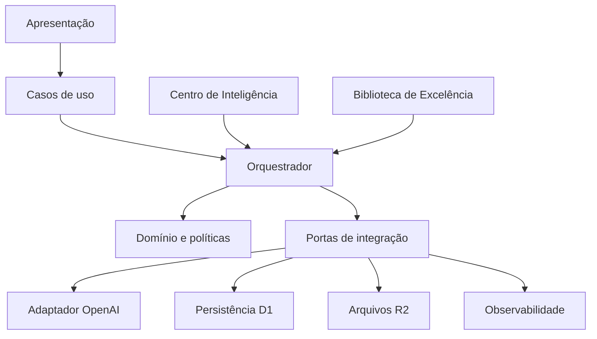

# Harmony Studio — Fase 1: Diagnóstico e Proposta Arquitetural

Status: proposta para aprovação  
Escopo: diagnóstico e arquitetura; nenhuma implementação funcional autorizada nesta fase

## 1. Objetivo

Transformar o Harmony Studio de um protótipo acoplado à interface e à API em uma plataforma de produção de anúncios profissionais, governada por conhecimento versionado, execução rastreável, revisão obrigatória e controle de custo.

O sistema deve funcionar como uma agência digital coordenada. “Agente” significa uma capacidade especializada com contrato de entrada, saída, regras e critérios de qualidade — não uma personalidade com acesso irrestrito a todo o contexto.

## 2. Inventário do estado atual

### Apresentação

- `app/page.tsx` concentra formulário, ficha fixa do produto, fluxo, chamadas HTTP, recuperação local, geração sequencial, download e mensagens de erro.
- O produto “Mini Sabonetes Rosinhas” e suas variações estão codificados diretamente na página.
- O rascunho é persistido somente no navegador por IndexedDB.
- Cinco briefings visuais estão codificados diretamente na interface.

### Aplicação e domínio

- Não existe camada de aplicação explícita.
- Não existe domínio próprio para anúncio, execução, etapa, aprovação, agente ou versão de conhecimento.
- A máquina de estados se resume a `upload`, `review` e `result` no componente de interface.
- Regras de negócio, apresentação e integração estão misturadas.

### Integração com IA

- `app/api/agents/analyze/route.ts` executa quatro chamadas sequenciais com instruções fixas: análise visual, estratégia, copy e revisão.
- `app/api/agents/images/route.ts` chama diretamente a Image API e, depois, tenta uma auditoria visual.
- Prompts, modelos, notas mínimas e tratamento de erro estão codificados nas rotas.
- Não existe adaptador de provedor, política central de repetição, orçamento por projeto, idempotência ou registro estruturado de consumo.
- A imagem cobrada é preservada quando a auditoria falha, mas a interface ainda pode apresentá-la como material final. Isso conflita com a aprovação obrigatória.

### Dados e armazenamento

- `.openai/hosting.json` mantém `d1` e `r2` desativados.
- O schema existente em `db/schema.ts` pertence principalmente ao sistema de estoque, usuários e solicitações da Harmony.
- Não há tabelas para projetos de anúncio, etapas, execuções, conhecimento, versões, exemplos, aprovações ou custos.
- Arquivos originais e imagens geradas não possuem armazenamento durável do Studio.

### Identidade e fronteiras do produto

- O repositório contém módulos e documentação do sistema de gestão de produção/estoque, além do Harmony Studio.
- Existem duas abordagens de identidade: cabeçalhos do ChatGPT Sites e cliente Supabase.
- A fronteira entre o Studio de anúncios e o sistema operacional da Harmony não está formalizada.

### Qualidade

- Não há suíte de testes específica para o Studio.
- Há caracteres UTF-8 corrompidos em arquivos do Studio.
- Não existem avaliações reproduzíveis dos agentes nem conjunto de referência aprovado.
- Logs atuais são técnicos; não formam uma trilha de decisão de negócio.

## 3. Divergências em relação aos princípios

| Princípio | Estado atual | Direção obrigatória |
|---|---|---|
| Modularidade | Fluxo concentrado em página e rotas | Módulos por capacidade e casos de uso |
| Baixo acoplamento | UI conhece prompts, etapas e produto | UI conversa somente com casos de uso |
| Escalabilidade | Execução presa à requisição e à aba | Jobs persistentes, estados recuperáveis e fila |
| Configuração acima de programação | Regras e prompts fixos no código | Conhecimento e parâmetros versionados no banco |
| Separação de contexto | Contexto montado manualmente nas rotas | Seleção explícita por política e contrato |
| Domínio independente | Regras misturadas com React/OpenAI | Entidades e políticas sem dependências externas |
| Revisão obrigatória | Candidata pode aparecer sem auditoria | Candidata interna separada de material liberado |
| Rastreabilidade | Logs de infraestrutura | Eventos, decisões, versões e consumo por etapa |

## 4. Fronteira recomendada

O Harmony Studio deve ser um contexto de negócio independente dentro do repositório. Ele pode compartilhar infraestrutura de autenticação e identidade quando isso for decidido explicitamente, mas não deve reutilizar entidades de estoque como se fossem entidades de anúncio.

Estrutura-alvo:

```text
src/harmony-studio/
  presentation/
  application/
    use-cases/
    ports/
    orchestration/
  domain/
    entities/
    value-objects/
    policies/
    events/
  infrastructure/
    openai/
    persistence/
    storage/
    observability/
  intelligence/
    contracts/
    schemas/
```

Rotas e componentes Next.js permanecem em `app/`, atuando como adaptadores de entrada. Eles não conterão regras dos agentes.

## 5. Modelo de domínio proposto

### Entidades principais

- `AdProject`: projeto de anúncio e seu estado global.
- `ProductSnapshot`: fatos confirmados do produto naquela execução.
- `SourceAsset`: imagem original, origem, hash e metadados.
- `WorkflowRun`: uma execução versionada do fluxo.
- `StageRun`: execução de uma etapa, tentativas, estado e custo.
- `AgentDefinition`: missão e identidade lógica do agente.
- `KnowledgeVersion`: conjunto imutável de regras publicado.
- `ContextBundle`: contexto mínimo selecionado para uma etapa.
- `ArtifactCandidate`: texto ou imagem ainda não liberado.
- `ReviewDecision`: aprovação, reprovação ou solicitação de ajuste.
- `ApprovedArtifact`: material elegível para o pacote final.
- `ExcellenceEntry`: referência curada e sua justificativa.
- `AuditEvent`: evento imutável da operação.

### Estados essenciais

```text
Projeto: draft -> ready -> running -> review_required -> approved -> exported
Etapa: pending -> running -> succeeded | failed | blocked | cancelled
Artefato: candidate -> pending_review -> approved | rejected | superseded
Conhecimento: draft -> published -> archived
```

### Invariantes

1. Um pacote final só contém `ApprovedArtifact`.
2. Uma candidata já cobrada nunca é apagada; pode permanecer interna e reprovada.
3. Uma repetição requer chave idempotente e registra a tentativa anterior.
4. Cada execução referencia versões imutáveis de conhecimento e configuração.
5. Fatos declarados pelo fabricante nunca podem ser substituídos por inferência visual.
6. Um agente recebe apenas os campos permitidos pelo contrato de sua etapa.
7. Alterações administrativas nunca modificam retroativamente execuções anteriores.

## 6. Arquitetura em camadas



Dependências apontam para dentro: infraestrutura implementa portas definidas pela aplicação; domínio não importa React, Next.js, OpenAI, D1 ou R2.

## 7. Centro de Inteligência

O Centro de Inteligência armazena, mas não executa, conhecimento. Cada versão publicada é imutável e contém:

- missão;
- escopo e dados permitidos;
- regras obrigatórias;
- boas práticas;
- proibições;
- checklist;
- schema de entrada;
- schema de saída;
- exemplos aprovados;
- parâmetros recomendados;
- autor, justificativa e histórico.

Edição cria rascunho; publicação cria nova versão. Rollback significa selecionar uma versão anterior para novas execuções, nunca reescrever o histórico.

## 8. Orquestrador

O orquestrador é determinístico sempre que possível. Ele:

1. valida a entrada sem gastar geração;
2. constrói o plano de execução;
3. seleciona versões dos agentes;
4. seleciona conhecimento relevante;
5. monta um `ContextBundle` por contrato;
6. agenda a etapa;
7. registra custo, duração e resultado;
8. avalia a transição de estado;
9. repete somente a etapa necessária;
10. encaminha candidatas para revisão.

O orquestrador não escreve títulos, descrições ou prompts criativos. Ele coordena.

## 9. Contratos iniciais dos agentes

| Agente | Recebe | Produz | Não recebe |
|---|---|---|---|
| Triagem | ficha e metadados das fotos | pendências e suficiência | exemplos criativos |
| Analista visual | fotos e fatos declarados marcados | observações e inconsistências | estratégia e copy |
| Estrategista | fatos aprovados e observações | intenção, termos e plano | prompts visuais finais |
| Copywriter | estratégia e fatos aprovados | candidatas textuais | imagens não necessárias |
| Diretor de arte | estratégia, fatos visuais e referências | briefings estruturados | descrição completa sem necessidade |
| Fotógrafo virtual | briefing e referências autorizadas | candidata visual | histórico dos demais agentes |
| Revisor de conformidade | candidata e fonte de verdade | decisão e correções | raciocínio interno dos produtores |
| Diretor de qualidade | decisões e métricas | liberação ou reprocessamento | contexto bruto irrelevante |

Os handoffs usam objetos validados por schema; não usam transcrições integrais de agentes anteriores.

## 10. Persistência proposta

### D1

Armazena projetos, snapshots, definições e versões de agentes, workflows, etapas, tentativas, decisões, custos, auditoria e metadados dos arquivos.

### R2

Armazena fotos originais, candidatas, imagens aprovadas, miniaturas e pacotes exportados.

### Fila de execução

Geração longa não pode depender da aba aberta. O desenho exige uma fila ou mecanismo de job durável, com retomada e consulta por `jobId`. A escolha concreta deve ser validada na fase de persistência/infraestrutura conforme as capacidades de hospedagem.

### Browser

IndexedDB permanece apenas como cache e conforto de uso. Não é fonte de verdade.

## 11. Biblioteca de Excelência

Somente materiais com aprovação final entram na biblioteca. Cada entrada registra:

- categoria, marketplace e objetivo;
- fatos do produto usados;
- versões dos agentes;
- artefato aprovado;
- decisões e correções;
- motivo de aprovação;
- aprovação humana;
- métricas futuras, quando disponíveis.

A recuperação deve combinar filtros determinísticos e relevância. Exemplos são referências, nunca regras fixas.

## 12. Segurança e governança

- Chaves de API permanecem exclusivamente no servidor.
- Conhecimento publicado é imutável.
- Painel administrativo exige papel autorizado.
- Toda alteração registra antes, depois, autor, data e justificativa.
- Dados de um projeto não entram no contexto de outro.
- Fotos e artefatos recebem política de retenção e exclusão.
- Logs não armazenam segredos nem cadeias de raciocínio privadas.
- Entradas externas e pesquisas são conteúdo não confiável.

## 13. Observabilidade e custo

Cada etapa registra:

- `projectId`, `workflowRunId`, `stageRunId`;
- agente e versão;
- modelo e parâmetros permitidos;
- hashes das entradas e saídas;
- início, fim e duração;
- tentativas e motivo de repetição;
- tokens, imagens e custo estimado;
- decisão do revisor;
- erro normalizado e identificador externo.

O orçamento é definido por projeto. A primeira arte é uma prova; as demais só são produzidas após aprovação humana ou política explícita.

## 14. Estratégia de migração

1. Congelar o fluxo atual como `legacy` e não ampliar seus prompts.
2. Corrigir UTF-8 antes de comparar resultados.
3. Criar o novo domínio e testes sem alterar a interface publicada.
4. Introduzir persistência do Studio em tabelas próprias.
5. Implementar Centro de Inteligência e versões.
6. Implementar orquestrador atrás de uma porta.
7. Encapsular OpenAI em adaptadores.
8. Migrar uma etapa por vez usando feature flag.
9. Executar fluxo antigo e novo em modo de comparação controlada.
10. Desativar o legado somente após critérios objetivos de qualidade, custo e recuperação.

## 15. Decisões arquiteturais propostas

1. **Monólito modular primeiro:** não adotar microsserviços nesta fase.
2. **Contexto Studio isolado:** tabelas, módulos e regras próprias.
3. **Configuração versionada:** prompts e checklists fora das rotas.
4. **Candidata não é entrega:** revisão obrigatória para exportação.
5. **Jobs duráveis:** execução longa independente da página.
6. **Prova antes do lote:** controle de qualidade e custo.
7. **OpenAI atrás de portas:** possibilidade de trocar modelo ou provedor.
8. **Schemas em todos os handoffs:** nenhuma saída livre controla o workflow.
9. **Idempotência obrigatória:** cliques e repetições não duplicam cobranças.
10. **Aprendizagem curada:** Biblioteca de Excelência antes de fine-tuning.

## 16. Riscos e respostas

| Risco | Resposta |
|---|---|
| Complexidade prematura | Monólito modular e entregas verticais pequenas |
| Custos imprevisíveis | orçamento, prova única, cache e telemetria |
| Imagem cobrada e perdida | job durável, R2 e idempotência |
| Agentes contraditórios | contratos, versões e revisor independente |
| Contexto excessivo | seleção por política e limites por agente |
| Mistura com sistema de estoque | contexto delimitado e schema próprio |
| Regressão durante migração | feature flags e comparação legado/novo |
| Conhecimento ruim virar padrão | curadoria humana e publicação versionada |

## 17. Plano de fases e gates

### Fase 1 — Diagnóstico e proposta

Entregável: este documento. Gate: aprovação das decisões e fronteiras.

### Fase 2 — Centro de Inteligência

Entregável: domínio de agentes, contratos, drafts e versões publicadas. Gate: criar, publicar e recuperar uma versão sem chamar IA.

### Fase 3 — Banco de conhecimento e persistência

Entregável: D1/R2, projetos, arquivos, execuções e auditoria. Gate: fechar e reabrir sem perder um projeto.

### Fase 4 — Biblioteca de Excelência

Entregável: curadoria, aprovação e recuperação contextual. Gate: somente aprovados são recuperáveis.

### Fase 5 — Orquestrador

Entregável: máquina de estados, contexto, idempotência e reprocessamento. Gate: simular falha e repetir apenas uma etapa.

### Fase 6 — Integração com API

Entregável: adaptadores, limites, custos e erros normalizados. Gate: testes controlados sem duplicação de cobrança.

### Fase 7 — Fluxo completo

Entregável: triagem até pacote aprovado. Gate: anúncio real com todas as decisões rastreadas.

### Fase 8 — Painel administrativo

Entregável: gestão de regras, versões, exemplos e parâmetros. Gate: alteração auditada sem deploy de código.

### Fase 9 — Testes e otimização

Entregável: avaliações, testes de carga, custo e qualidade. Gate: metas aprovadas para produção.

## 18. Critérios de conclusão da Fase 1

- [x] Estado atual inventariado.
- [x] Divergências documentadas.
- [x] Fronteira do Studio proposta.
- [x] Arquitetura-alvo definida.
- [x] Entidades, estados e invariantes definidos.
- [x] Contratos iniciais dos agentes definidos.
- [x] Estratégia de persistência e recuperação definida.
- [x] Migração incremental definida.
- [x] Riscos e respostas registrados.
- [x] Gates das fases definidos.

## 19. Aprovação necessária

A Fase 2 só deve começar após aprovação explícita destes pontos:

1. Harmony Studio como contexto independente dentro do repositório.
2. Monólito modular, sem microsserviços neste momento.
3. D1 para estado e R2 para arquivos.
4. Candidatas preservadas, mas somente aprovadas entram no kit final.
5. Prova visual antes do lote completo.
6. Oito responsabilidades iniciais de agentes.
7. Migração gradual com fluxo legado preservado por feature flag.

