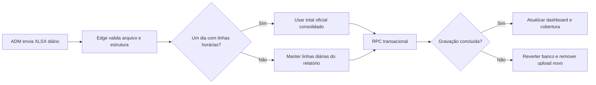

# Auditoria das correções v25.91 — 2026-08-15

## Escopo

1. Agenda Harmony responsiva na Home móvel.
2. Importação de Estatísticas da Loja para um único dia.
3. Calendário de cobertura dos dados Shopee.

## Integridade preservada

- Nenhuma tabela, coluna, política, perfil ou permissão foi criada, removida ou ampliada.
- Nenhuma regra de estoque, produção, solicitação ou pagamento foi modificada.
- `shopee_import_days` continua sendo a fonte canônica e exclusiva de `tipo + data`.
- A importação permanece protegida por hash, validação estrutural, autenticação administrativa, RLS e transação no PostgreSQL.
- O calendário executa somente leitura e não substitui dados.

## Fluxo da planilha diária

## Riscos e controles

| Risco | Controle aplicado |
|---|---|
| Somar 24 vezes métricas de um único dia | Detecção explícita de horário e uso exclusivo da linha consolidada |
| Alterar o comportamento semanal | Condição restrita a período com início igual ao fim |
| Deixar arquivo órfão no Storage | Limpeza somente do upload criado pela tentativa que falhou |
| Apagar arquivo já utilizado | O indicador `uploadedNow` impede remover objetos pré-existentes |
| Confundir cor com ação automática | Legenda, texto acessível e botão explícito para abrir importação |
| Agenda cobrir conteúdo no celular | Botões mantidos no fluxo normal e grade responsiva em duas colunas |

## Retorno seguro

Os arquivos anteriores estão preservados em `backups/20260815-pre-v25.91`, acompanhados de `SHA256SUMS.txt`. Como não há migração de banco nesta versão, a reversão é exclusivamente de código e ativos do PWA.
