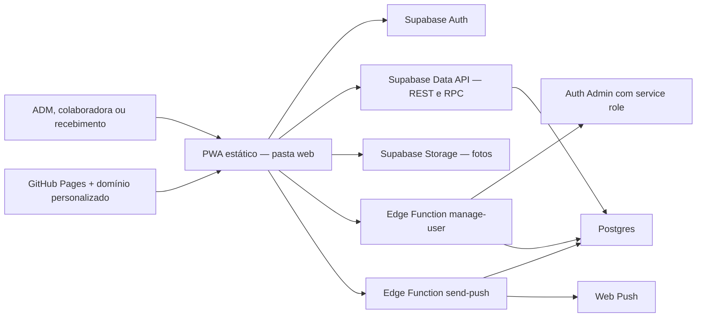

# Harmony Store Oficial — Auditoria das Fases 0 e 1

Data da análise: 19/07/2026  
Escopo aprovado: inventário, proteção e auditoria somente leitura.  
Estado: diagnóstico concluído; nenhuma mudança estrutural foi aplicada ao aplicativo ou ao banco.

## Parecer executivo

O sistema está adequado ao tamanho atual da operação: um PWA estático, sem servidor próprio, usando Supabase para autenticação, banco, arquivos e funções administrativas. Para cerca de 11 pessoas, essa arquitetura é simples, econômica e suficiente. Não recomendo reescrever o aplicativo nem transformá-lo em uma plataforma complexa.

O aplicativo constrói corretamente, a versão pública abre em computador e celular, e os 21 testes existentes passaram. As regras centrais de solicitações, produção, conferência, pagamentos proporcionais e privacidade de valores estão representadas no banco e nos testes.

Porém, o projeto ainda não está pronto para receber uma camada grande de monitoramento, documentação e automação sem antes corrigir a base de segurança e continuidade. O principal risco confirmado é que qualquer ADM ativo consegue trocar o login e a senha do ADM principal. Também não há um processo confiável de versão, backup restaurável, publicação automatizada ou recuperação testada.

Recomendação: manter a arquitetura atual, corrigir primeiro os riscos críticos e altos, criar um processo de publicação e restauração e só depois construir a Central de Ajuda e a aba Saúde do Sistema.

## O que foi verificado

- Código realmente publicado na pasta `web`.
- Estrutura auxiliar Next/Cloudflare existente em `app`, `worker` e configurações relacionadas.
- Autenticação e armazenamento da sessão no navegador.
- Chamadas REST/RPC e funções Edge do Supabase.
- Migrações SQL 001 a 011 e o script 002 localizado fora da pasta de migrations.
- RLS, funções `security definer`, Storage e papéis de usuário.
- PWA, manifest, service worker, instalação e responsividade pública.
- Testes automatizados, construção estática, tamanho dos arquivos e processo de publicação.
- Estratégia atual de histórico, backup, monitoramento e recuperação.

## Evidências de teste

| Verificação | Resultado |
|---|---|
| Build estático | Aprovado |
| Testes automatizados disponíveis | 21 aprovados, 0 falhas |
| Página pública de login | Carregou corretamente |
| Layout público em 390 × 844 px | Sem rolagem horizontal |
| Botão de instalação na página pública | Visível |
| Erros/alertas no console da página pública | Nenhum observado |
| Lint | Não executado: dependências de desenvolvimento ausentes e download bloqueado no ambiente |
| Testes autenticados por papel no banco real | Não executados: não foram usadas credenciais reais nesta auditoria |
| Security Advisor e Performance Advisor do Supabase real | Não acessados nesta cópia local |
| Restauração de backup | Não testada: não existe backup automatizado nem ambiente isolado de restauração |

Os testes atuais validam regras específicas, mas não são testes de invasão, de indisponibilidade, de restauração nem uma prova de que as políticas implantadas no banco real são idênticas aos arquivos locais.

## Arquitetura atual

A pasta `web` é copiada diretamente para `dist/client`. A aplicação Next/React de `app` e o worker em `worker` não fazem parte da versão publicada. Essa duplicidade não quebra a produção atual, mas induz manutenção no local errado.

## Riscos encontrados

### Crítico

#### C-01 — ADM comum pode tomar a conta do ADM principal

A função Edge `manage-user` permite que qualquer perfil `admin` ativo execute uma atualização. Para o alvo principal, ela preserva apenas `role=admin` e `status=active`, mas atualiza e-mail/login e senha antes dessa proteção. Assim, um ADM comum pode substituir as credenciais do ADM principal.

Impacto: perda de controle da conta principal e acesso total ao sistema.  
Correção recomendada: somente o próprio ADM principal deve alterar suas credenciais; outro ADM não pode modificar login, senha, CPF ou identidade da conta principal. Exigir reautenticação recente e, idealmente, MFA para ações de alto risco.

### Alto

#### A-01 — Não há histórico Git local válido, CI/CD ou rollback reproduzível

A pasta `.git` desta cópia está vazia e `git status` não reconhece um repositório. Não há workflows em `.github`. A publicação depende de copiar/subir arquivos manualmente.

Impacto: perda de histórico, publicação parcial, dificuldade para voltar à versão anterior e maior chance de erro humano.

#### A-02 — Não há backup automático restaurável nem teste de recuperação

Não existe rotina versionada de `supabase db dump`/`pg_dump`, cópia protegida de arquivos do Storage, retenção, verificação de integridade ou restauração em ambiente isolado.

Impacto: um backup anunciado pelo provedor pode não ser um arquivo lógico reutilizável; a recuperação real permanece desconhecida.

#### A-03 — Proteção incompleta da conta inicial e das senhas

O campo `must_change_password` é criado e marcado como verdadeiro, mas não é consultado pelo aplicativo. A senha definida pelo ADM pode permanecer indefinidamente. Não há evidência local de MFA para administradores nem de revisão da política de senhas do projeto real.

Impacto: senha temporária compartilhada ou comprometida continua válida.

#### A-04 — Funções privilegiadas sem revogação explícita de `PUBLIC`/`anon`

Diversas funções `security definer` das migrations 003, 004, 007, 008 e 009 recebem `grant execute` para `authenticated`, mas não revogam primeiro a permissão padrão de `PUBLIC`. As verificações internas de usuário/ADM reduzem a exploração atual, porém a fronteira fica frágil e um erro futuro numa função privilegiada pode expor dados ou escrita anônima.

Impacto: aumento do risco de bypass de RLS em funções futuras ou alteradas.

#### A-05 — Grants do esquema inicial não são reproduzíveis

A migration inicial habilita RLS, mas não declara de forma completa os `GRANT`/`REVOKE` das tabelas, sequências e funções básicas. O aplicativo real funciona, indicando que o projeto implantado possui permissões suficientes, mas uma reconstrução em projeto novo pode se comportar de forma diferente. Mudanças recentes do Supabase tornam grants explícitos ainda mais importantes.

Impacto: restauração ou implantação nova pode abrir permissões demais ou impedir o funcionamento.

#### A-06 — Exclusão física de colaboradora conflita com o histórico

Excluir o usuário no Auth tenta apagar o perfil por cascata. Solicitações, recebimentos e fechamentos referenciam o perfil com `on delete restrict`. Portanto, uma pessoa com histórico operacional ou financeiro não pode ser apagada sem violar integridade — e não deveria ser apagada por exigências de auditoria.

Impacto: botão de excluir falha para usuários reais ou força perda indevida de histórico.

Correção recomendada: desativação/anônimização controlada; exclusão física apenas para cadastro sem qualquer movimento.

#### A-07 — Operações importantes não são atômicas

O cadastro/edição de produto, ajuste de estoque, histórico e vínculo com fornecedor são gravados por chamadas separadas do navegador. Se uma chamada falhar, o produto pode ficar salvo sem vínculo, o estoque pode mudar sem movimento correspondente ou o histórico pode faltar. O próprio código já trata parcialmente esse cenário com mensagens, mas não consegue desfazer a primeira etapa.

Impacto: divergência entre estoque, fornecedor e auditoria.

### Médio

#### M-01 — Histórico de auditoria não é confiável como trilha de segurança

Qualquer usuário autenticado pode inserir uma linha em `audit_logs` desde que use seu próprio `actor_id`. A ação, entidade e detalhes são definidos pelo navegador. Além disso, a função cliente ignora falhas de gravação.

Impacto: eventos podem ser forjados, omitidos ou ficar incompletos. O histórico atual é útil como registro operacional, não como prova de auditoria.

#### M-02 — Sessão persistida em `localStorage` e ausência de política CSP versionada

O access token e o refresh token ficam no `localStorage`. Essa abordagem é comum em SPA/PWA, mas qualquer XSS que seja introduzido no futuro poderia ler a sessão. O código escapa a maior parte dos dados dinâmicos e não foi encontrado um XSS explorável confirmado, porém não há Content Security Policy no HTML nem configuração versionada de cabeçalhos de segurança.

Impacto: aumenta o efeito de um eventual XSS.

#### M-03 — Fotos de perfil são públicas

O bucket `profile-images` permite leitura por `public`. Quem conhecer a URL consegue visualizar a foto sem autenticação.

Impacto: exposição desnecessária de dado pessoal.

#### M-04 — CPF protegido por hash simples, sem segredo

O CPF é reduzido a dígitos e armazenado como SHA-256 sem salt secreto. Isso evita texto puro, mas CPFs pertencem a um espaço pequeno e podem ser testados por força bruta offline.

Impacto: pseudonimização fraca em caso de vazamento do banco.

#### M-05 — Dependência Edge não fixada

As funções Edge importam `@supabase/supabase-js@2`, sem versão exata. Uma nova publicação futura pode resolver outra versão e alterar o comportamento. `web-push` está fixado.

#### M-06 — Teste padrão não executa a suíte completa

O script `npm test` executa apenas `rendered-html.test.mjs`. Os 21 testes só passaram porque a auditoria executou manualmente `tests/*.test.mjs`.

Impacto: uma rotina futura pode mostrar sucesso ignorando a maior parte dos testes.

#### M-07 — Sem paginação e consultas amplas

Produtos, solicitações, equipe, fornecedores, pedidos, itens e recebimentos são carregados em listas completas. Para 11 usuários, o desempenho é aceitável. Com histórico crescente, o tempo de abertura e o consumo de dados aumentarão.

#### M-08 — PWA baixa imagens desnecessariamente grandes

O service worker inclui no cache inicial `brand-mark.png` (~1,0 MB) e `app-icon-master.png` (~0,85 MB), além dos ícones derivados. A maior parte dos ~2,8 MB da pasta `web` está em imagens.

Impacto: instalação e primeira atualização mais lentas em celular.

#### M-09 — Monitoramento e alertas inexistentes

Não há captura central de erro do navegador, correlação de requisições, alerta de falha de Edge Function, monitoramento de disponibilidade, verificação de backup ou SLO definido.

#### M-10 — Notificações são best effort

O envio é disparado pelo navegador depois de a operação principal terminar; falhas são ignoradas e não há fila, retentativa ou registro de entrega. Isso é adequado como conveniência, mas não como aviso garantido.

### Baixo / manutenção

- README descreve o starter Vinext, não o sistema Harmony realmente publicado.
- O nome e a versão do `package.json` ainda são do starter.
- A migration 002 está fora de `supabase/migrations`, dificultando reconstrução ordenada.
- Código de produção está concentrado em JavaScript grande e baseado em substituições/observers, o que aumenta fragilidade de manutenção.
- As funções Edge retornam parte das mensagens internas de erro ao navegador e usam CORS `*`; não há exploração confirmada, mas convém normalizar erros e limitar origens.

## Pontos positivos confirmados

- Não há `service_role` ou senha do banco no frontend ou no `.env.local` auditado.
- A chave presente em `web/app.js` é uma chave publicável, apropriada para cliente quando RLS está correto.
- Todas as tabelas de negócio encontradas habilitam RLS.
- As regras de solicitações próprias e separação administrativa estão majoritariamente no banco, não apenas escondidas na interface.
- Funções financeiras e de produção verificam o papel do usuário e preservam snapshot do valor por 100 unidades.
- A migration 011 esconde valores de recebimentos abertos de colaboradoras e recebimento, mantendo o total do fechamento semanal para a própria colaboradora.
- Funções mais novas da migration 010 revogam explicitamente acesso público.
- Uploads validam tipo e limite de 2 MB no navegador e no bucket.
- O service worker não armazena respostas da API do Supabase, pois só intercepta GET da própria origem.
- A criação de solicitação atual usa RPC atômica.

## Verificações necessárias no Supabase real

Estas evidências não estão disponíveis apenas no código local e devem fazer parte da próxima fase controlada:

1. Exportar os resultados do Security Advisor e do Performance Advisor.
2. Conferir políticas e grants efetivamente implantados, não apenas migrations locais.
3. Conferir proteção contra senhas vazadas, tamanho mínimo e limites de tentativas.
4. Conferir MFA e sessões dos três administradores.
5. Confirmar plano, retenção e última execução válida de backup do projeto.
6. Fazer dump lógico e restaurar em um projeto isolado.
7. Conferir logs de Auth, Postgres, Edge Functions e Storage.
8. Comparar hashes/contagens do Storage com os caminhos registrados no banco.

## Conclusão

O sistema deve continuar como PWA + Supabase. A base funcional é boa e proporcional ao negócio, mas a segurança da conta principal, a continuidade e a integridade de operações compostas precisam vir antes de uma aba sofisticada de saúde. Uma aba verde sem backup restaurado e sem telemetria confiável criaria falsa segurança.

Próximo marco recomendado: aprovar a Fase 2A do plano, limitada a proteção crítica, versionamento e preparação de backup, com pacote reversível e testes por papel.
