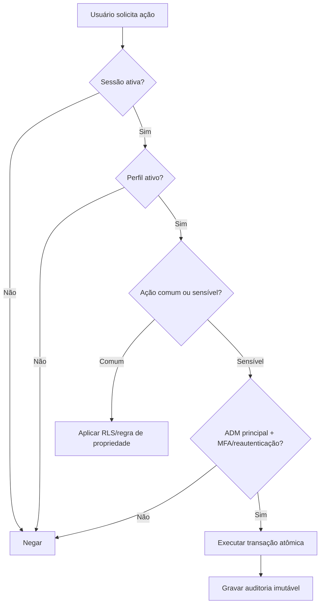

# Matriz de permissões — estado atual auditado

Legenda: **Sim** = permitido pela regra atual; **Próprio** = somente registros da própria pessoa; **Limitado** = permitido com restrições; **Não** = bloqueado pela regra de negócio/RLS; **UI** = escondido apenas na interface, devendo sempre existir bloqueio também no banco.

| Capacidade | Anônimo | Colaboradora | Recebimento | ADM | ADM principal |
|---|---:|---:|---:|---:|---:|
| Entrar no sistema | Tela apenas | Sim | Sim | Sim | Sim |
| Ver produtos ativos/categorias | Não | Sim | Sim | Sim | Sim |
| Criar solicitação de matéria-prima | Não | Próprio | Próprio | Não na UI | Não na UI |
| Ver solicitações | Não | Próprio | Próprio | Todas | Todas |
| Editar/cancelar solicitação pendente | Não | Próprio | Próprio | Gestão completa | Gestão completa |
| Separar, ajustar, agendar e concluir | Não | Não | Não | Sim | Sim |
| Excluir solicitação definitivamente | Não | Não | Não | Sim | Sim |
| Cadastrar/editar produto e estoque | Não | Não | Não | Sim | Sim |
| Cadastrar fornecedores/compras | Não | Não | Não | Sim | Sim |
| Ver custos e inteligência de compras | Não | Não | Não | Sim | Sim |
| Ver modelos acabados | Não | Sim, sem tarifa | Sim, sem tarifa | Sim | Sim |
| Registrar recebimento de produção | Não | Não | Sim | Sim | Sim |
| Editar/excluir recebimento aberto | Não | Não | Próprio lançamento | Todos | Todos |
| Ver produções recebidas | Não | Próprio | Todas, sem valores | Todas | Todas |
| Ver valor de recebimento ainda aberto | Não | Não | Não | Sim | Sim |
| Ver pagamentos semanais | Não | Próprio | Valores ocultos | Todos | Todos |
| Fechar semana/marcar pagamento | Não | Não | Não | Sim | Sim |
| Editar o próprio perfil/foto/senha | Não | Sim | Sim | Sim | Sim |
| Ver equipe | Não | Não | Lista operacional | Todos | Todos |
| Criar/editar colaboradora | Não | Não | Não | Sim | Sim |
| Criar outro ADM | Não | Não | Não | Não | Sim |
| Excluir usuário sem histórico | Não | Não | Não | Somente se ADM principal | Sim |
| Alterar credenciais do ADM principal | Não | Não | Não | Não | Próprias |
| Ver histórico de atividades | Não | Não | Não | Sim | Sim |
| Inserir evento no histórico | Não | Não | Não | Somente por RPC/Edge confiável | Somente por RPC/Edge confiável |
| Ler a própria foto de perfil | Não | Próprio | Próprio | Sim | Sim |
| Ler fotos de perfil da equipe | Não | Não | Sim | Sim | Sim |

## Regras formalizadas e pendências

1. **Concluído:** somente o ADM principal altera suas próprias credenciais e os privilégios de outros ADMs.
2. **Concluído:** ADM comum administra colaboradoras e recebimento, mas não cria nem promove outro ADM.
3. **Concluído:** exclusão de pessoa com histórico vira desativação e preserva o histórico financeiro e operacional.
4. **Concluído — Fase 2B:** a trilha de auditoria é imutável e escrita somente por banco/Edge confiável, nunca livremente pelo navegador.
5. **Concluído:** recebimento pode solicitar matéria-prima, registrar conferências e ver produção sem valores.
6. **Concluído:** colaboradoras veem o pagamento semanal fechado, mas não estimativas de produção ainda não conferida/fechada.
7. **Concluído:** o papel anônimo não possui privilégios em tabelas, sequências ou funções do schema `public`.
8. **Concluído — Fase 2B:** fotos de perfil usam leitura autenticada com regra de proprietária, recebimento ou ADM.

## Fluxo de decisão recomendado para ações sensíveis

