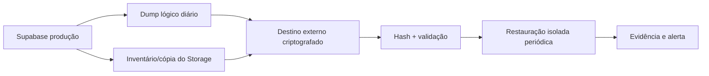
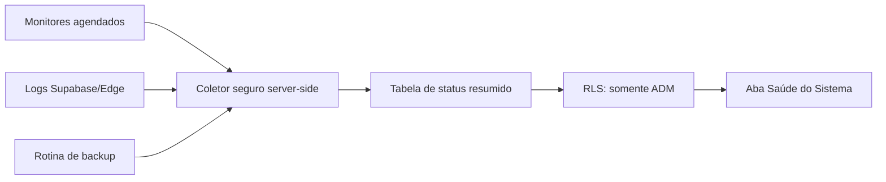
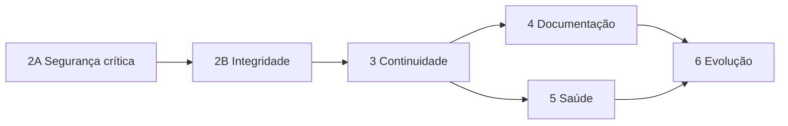

# Plano por fases — impacto, risco e benefício

Nenhuma fase abaixo está autorizada automaticamente. Cada fase deve gerar backup, pacote de mudanças, testes e instruções de publicação antes de ser aplicada ao ambiente oficial.

## Fase 2A — Proteção crítica e base de continuidade

Prazo sugerido: 1 ciclo curto.  
Risco de implantação: baixo a médio.  
Benefício: muito alto.

Entregas:

1. Bloquear alteração das credenciais do ADM principal por outro ADM.
2. Separar poderes de ADM comum e ADM principal.
3. Revogar `PUBLIC`/`anon` de todas as funções e conceder apenas o necessário.
4. Declarar grants de tabelas, sequências, funções e Storage de forma reproduzível.
5. Ativar fluxo obrigatório de troca de senha inicial.
6. Definir desativação/anônimização no lugar de exclusão física com histórico.
7. Rotacionar a senha do banco anteriormente compartilhada e revisar segredos Edge.
8. Fixar versões exatas das dependências das funções Edge.
9. Transformar a cópia oficial em repositório Git íntegro, com tags de versão e branch protegida.
10. Corrigir `npm test` para executar todos os testes.

Critério de aceite:

- Testes de permissão para anônimo, colaboradora, recebimento, ADM e ADM principal.
- ADM comum recebe 403 ao tentar alterar o ADM principal.
- Aplicação reconstruída do zero a partir das migrations em ambiente isolado.
- Rollback documentado e testado.

## Fase 2B — Integridade transacional e auditoria confiável

Prazo sugerido: 1 a 2 ciclos.  
Risco de implantação: médio.  
Benefício: alto.

Entregas:

1. Mover cadastro/edição de produto + estoque + fornecedor + auditoria para RPC transacional.
2. Tornar eventos de auditoria imutáveis e gravados somente por banco/Edge confiável.
3. Registrar antes/depois, correlação, ator e origem das ações sensíveis.
4. Restringir fotos de perfil a usuários autenticados ou URLs assinadas.
5. Trocar hash simples do CPF por HMAC com segredo/estratégia segura de deduplicação.
6. Padronizar erros Edge sem expor detalhes internos.
7. Implementar paginação e filtros no servidor para históricos crescentes.

Critério de aceite:

- Falha simulada no vínculo do fornecedor desfaz toda a operação.
- Usuário comum não consegue criar evento arbitrário na auditoria.
- Auditoria registra corretamente sucessos e falhas relevantes.

## Fase 3 — Backup, recuperação e publicação automatizada

Prazo sugerido: 1 a 2 ciclos.  
Risco de implantação: médio.  
Benefício: muito alto.

Entregas:

1. CI com build, suíte completa, validações SQL estáticas e verificação do PWA.
2. Publicação automática com ambiente de homologação e aprovação manual para produção.
3. Dump lógico diário criptografado fora do Supabase, com retenção definida.
4. Inventário e cópia dos objetos do Storage.
5. Relatório automático de backup válido, tamanho, hash e idade.
6. Restauração trimestral em ambiente isolado e relatório de evidência.
7. Runbook de incidente, contatos, RPO e RTO.

Metas iniciais sugeridas:

- RPO: no máximo 24 horas de dados para backup lógico externo; reduzir depois conforme custo.
- RTO: restauração funcional em até 8 horas inicialmente.
- Retenção: 30 diários, 12 mensais e versões antes de cada migration.

## Fase 4 — Documentação em três níveis

Prazo sugerido: 2 ciclos curtos.  
Risco de implantação: baixo.  
Benefício: alto.

Entregas:

1. Ajuda rápida contextual dentro de cada tela, curta e orientada à tarefa.
2. Manual completo por módulo para ADM, recebimento e colaboradora.
3. Documentação técnica versionada: arquitetura, dados, RLS, RPCs, Edge, deploy, backup e recuperação.
4. Diagramas de sequência e regras de negócio.
5. Changelog gerado a partir de versões/tags e exibido no app.
6. Controle de versão da documentação junto com o código.

Princípio: a ajuda não deve poluir as telas. Usar ícone discreto, resumo de 2–4 linhas e link para o manual detalhado.

## Fase 5 — Saúde do Sistema

Prazo sugerido: 2 ciclos.  
Risco de implantação: médio.  
Benefício: médio a alto.

Entregas mínimas e úteis:

- Disponibilidade da página e latência percebida.
- Consulta autenticada de leitura do Supabase.
- Estado das Edge Functions e último erro agregado.
- Estado do envio de notificações.
- Último backup lógico válido e último teste de restauração.
- Versão instalada/publicada e versão do banco.
- Erros por período, sem CPF, tokens, senhas ou conteúdo sensível.
- Indicadores verde, amarelo e vermelho com critérios objetivos.

Arquitetura segura sugerida:

A aba não deve consultar segredos nem logs brutos diretamente do navegador. Ela exibe somente indicadores resumidos e saneados produzidos por um coletor confiável.

## Fase 6 — Performance e acabamento

Prazo sugerido: contínuo.  
Risco de implantação: baixo.  
Benefício: médio.

- Otimizar imagens e retirar masters do cache inicial.
- Paginar históricos.
- Remover ou arquivar a estrutura Next/Cloudflare não utilizada.
- Dividir o JavaScript por módulos com contratos testáveis.
- Adicionar testes E2E dos principais fluxos em celular e computador.
- Revisar acessibilidade, foco, contraste e navegação por teclado.

## Ordem recomendada

Não iniciar a Fase 5 antes de existir uma rotina real de backup e recuperação; caso contrário, o painel apenas mostraria indicadores sem fundamento.
