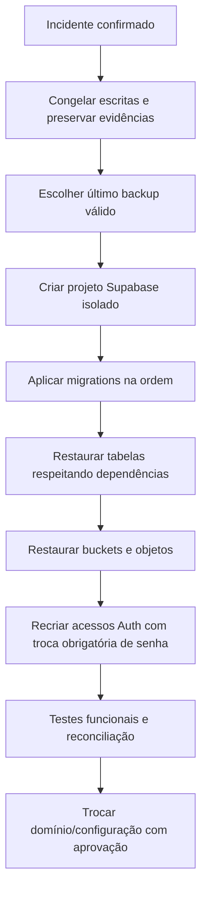

# Runbook de backup e recuperação

## Objetivos

- **RPO:** até 24 horas de dados, conforme a execução diária.
- **RTO operacional:** até 8 horas após disponibilizar um novo projeto Supabase e o domínio.
- **Retenção:** 30 dias no artefato privado do GitHub Actions.

O plano gratuito do Supabase não oferece backups agendados do banco. Esta rotina externa complementa a exportação manual já guardada pela empresa; não substitui um backup físico nativo do Postgres em planos superiores.

## Rotina automática

1. GitHub Actions executa diariamente às 03:17 UTC.
2. Exporta tabelas por Data API, inventário de usuários Auth e todos os arquivos do Storage.
3. Gera manifesto com contagens, migrations e SHA-256 de cada arquivo.
4. Revalida todos os hashes.
5. Compacta e criptografa com AES-256-CBC/PBKDF2.
6. Registra apenas status, tamanho, hash e estatísticas no Supabase.
7. Guarda o artefato criptografado por 30 dias.

Segredos exigidos no repositório: `SUPABASE_BACKUP_SECRET_KEY`, uma chave `sb_secret_` exclusiva e revogável, e `BACKUP_ENCRYPTION_PASSWORD`, uma senha longa exclusiva. Nunca cole esses valores em arquivos, issues, logs ou commits.

## Verificação mensal

1. Baixe o artefato mais recente em ambiente administrativo seguro.
2. Confira o SHA-256 registrado.
3. Descriptografe para uma pasta temporária.
4. Execute `node scripts/verify-api-backup.mjs PASTA`.
5. Execute `node scripts/restore-api-backup.mjs PASTA`; o modo seguro apenas verifica a prontidão.
6. Registre data, responsável e resultado do ensaio.
7. Apague os arquivos descriptografados após o teste.

## Recuperação real

Nunca restaure diretamente sobre a produção existente. Crie um projeto isolado, aplique todas as migrations, confira o manifesto e só então importe os dados. O inventário de Auth não contém senhas recuperáveis; usuários precisam ser recriados com senha temporária e troca obrigatória. Dados JSON exportados devem ser importados em ordem de chaves estrangeiras e reconciliados antes da troca de tráfego.

## Incidentes e alertas

- **Backup amarelo:** mais de 30 horas; conferir o workflow.
- **Backup vermelho:** inexistente ou mais de 48 horas; executar manualmente e corrigir antes de outras mudanças.
- **Hash inválido:** não usar o artefato; preservar para análise e voltar ao anterior.
- **Chave possivelmente exposta:** revogar imediatamente, gerar outra exclusiva e atualizar o segredo do GitHub.
- **Falha de restauração:** manter produção congelada, registrar a etapa e usar o backup válido anterior.
