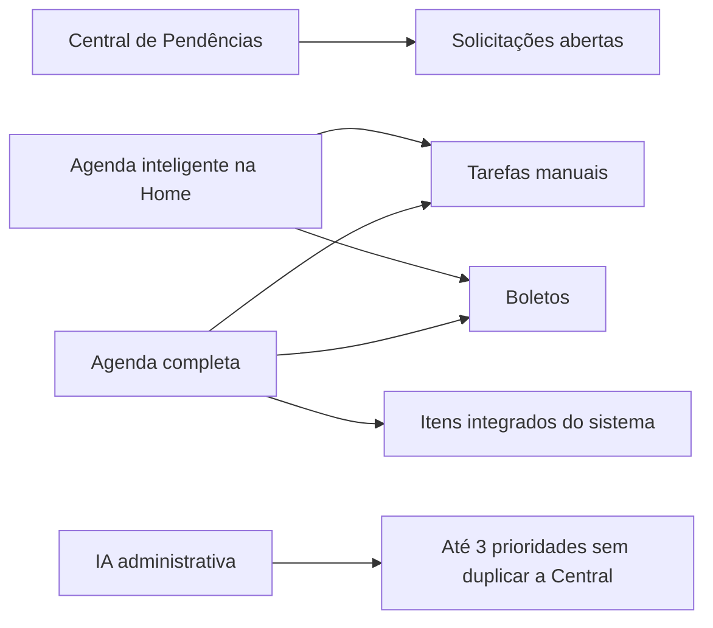

# Agenda Harmony Inteligente — especificação técnica v25.78

## Separação de responsabilidades

## Origem dos dados da Home

`homeAgendaItems()` filtra itens abertos cujos tipos são exclusivamente `manual` ou `bill`. O filtro é intencional: solicitações são apresentadas pela Central de Pendências e ordens de produção permanecem na Agenda completa.

`homeCalendarWeek()` cria a janela móvel de sete dias a partir da data atual, mantém datas vazias visíveis e limita a prévia diária a três entradas. O clique usa `data-agenda-home-preview-day` para abrir a página completa filtrada.

`homeAiInsights()` produz no máximo três cartões compactos e descarta candidatos de IA ligados a solicitações ou ordens. Quando necessário, complementa a visão com a qualidade de localização das caixas do inventário.

## Segurança e custos

- O calendário não faz nova chamada à OpenAI.
- A análise paga continua acontecendo somente quando o ADM solicita uma nova análise.
- A função Edge recebe apenas o contexto administrativo já autorizado e devolve texto; não recebe capacidade de escrita operacional.
- As políticas de acesso do Supabase não foram modificadas.

## Responsividade

- Computador: sete colunas e faixa lateral de inteligência.
- Tablet: grade adaptativa sem perda de informações.
- Celular: trilho horizontal de dias, detalhe do dia selecionado e botão para a Agenda filtrada.
