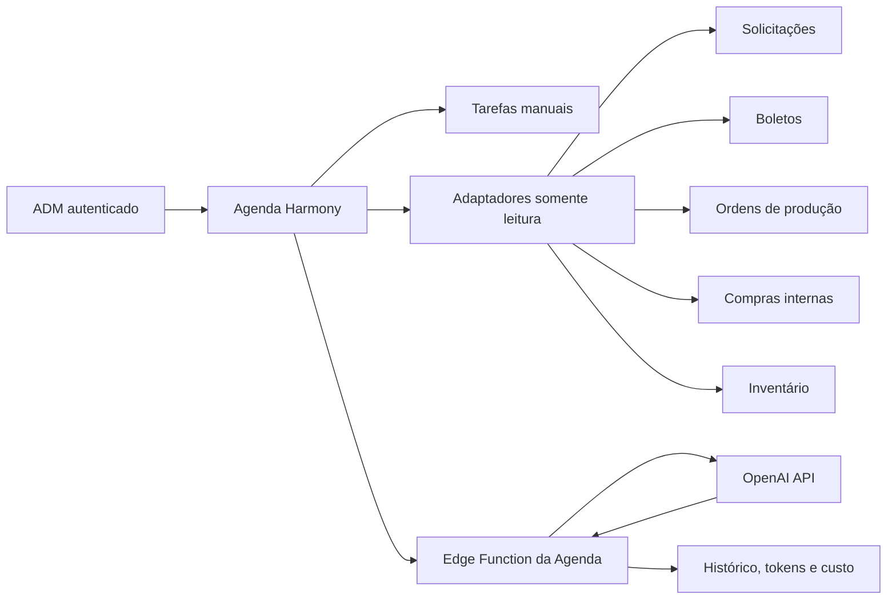

# Agenda Harmony — arquitetura técnica da versão 25.75

## Objetivo

A Agenda Harmony organiza tarefas e compromissos administrativos e consolida prazos existentes sem duplicar as regras dos módulos operacionais. O acesso é exclusivo para perfis `admin` ativos.

## Separação de responsabilidades

- `admin_agenda_tasks`: tarefas e compromissos próprios dos ADMs.
- `admin_agenda_task_events`: histórico imutável das ações da tarefa.
- `admin_agenda_reminder_deliveries`: idempotência e tentativas dos lembretes push.
- `admin_agenda_ai_settings`: limite financeiro e intervalo de segurança.
- `admin_agenda_ai_runs`: histórico das análises, tokens, custo e resultado.

Solicitações, boletos, ordens, compras e inventário continuam sendo as fontes oficiais. A Agenda apenas calcula uma visão temporal em memória e abre o módulo original ao clicar.

## Segurança e permissões

- Todas as tabelas possuem RLS e política `private.is_admin()`.
- Escritas passam por RPCs `security definer` com checagem explícita do perfil ativo e privilégios revogados de `public`, `anon` e acesso direto de `authenticated`.
- O navegador nunca recebe a chave da OpenAI nem a chave secreta do Supabase.
- A Edge Function revalida o JWT com `auth.getUser` e consulta `profiles.role/status` no servidor.
- A IA não possui código de escrita para boletos, solicitações, ordens ou inventário.
- O texto enviado à IA no resumo diário contém apenas datas, estados, prioridades, valores consolidados de boletos e contagens; não envia nomes de colaboradoras.

## IA e custo

- Modelo padrão: `gpt-5.6-luna`, configurável por segredo `OPENAI_AGENDA_MODEL`.
- Orçamento inicial: US$ 2 por mês.
- Abertura da Agenda, calendário, filtros e Home não chamam a API.
- Somente `Organizar anotação com IA` e `Analisar meu dia com IA` geram uma chamada.
- Há limite diário, cooldown, cache do resumo quando os dados não mudaram e registro de tokens/custo.
- A saída usa JSON Schema estrito. O ADM revisa a tarefa sugerida antes de salvar.

## Lembretes

`send-agenda-reminders` é uma função interna, aceita apenas chave secreta confiável e reutiliza as inscrições push já cadastradas. A tabela de entregas evita duplicidade por tarefa e ADM. Nenhum lembrete é enviado a colaboradoras ou ao perfil de Recebimento.

O agendamento recorrente da função deve ser configurado no ambiente seguro do Supabase/GitHub, nunca no navegador. Se o agendador estiver indisponível, a Agenda e as tarefas continuam funcionando; somente o push programado fica pendente.

## Compatibilidade e recuperação

- Alteração aditiva; nenhuma tabela ou política operacional foi removida.
- A Home das colaboradoras não é modificada.
- A partir da correção 25.76, somente o painel antigo `Meu dia` fica oculto enquanto a Agenda está montada. A Central de pendências e as Solicitações recentes permanecem visíveis na Home administrativa.
- O calendário compacto da Home calcula os próximos sete dias em memória e abre a data correspondente na Agenda, sem duplicar registros no banco.
- Todas as novas tabelas fazem parte do backup criptografado e da restauração isolada.
- Tag de retorno criada antes da implementação: `backup/pre-agenda-harmony-v25.74-20260812`.

## Testes obrigatórios

1. RLS nega leitura e RPCs para colaboradora e Recebimento.
2. ADM cria, edita, conclui, cancela e reabre tarefa com evento e auditoria.
3. Home do ADM exibe a Agenda; Home da colaboradora mantém notificações e pedidos.
4. Clique em item de sistema abre seu módulo original.
5. IA respeita JWT, orçamento, cooldown, limite diário e indisponibilidade sem bloquear a Agenda.
6. Layout funciona em computador, tablet e celular.
7. Service worker renova cache e inclui os ativos 25.75.
8. Backup e recuperação reconhecem as cinco tabelas novas.
