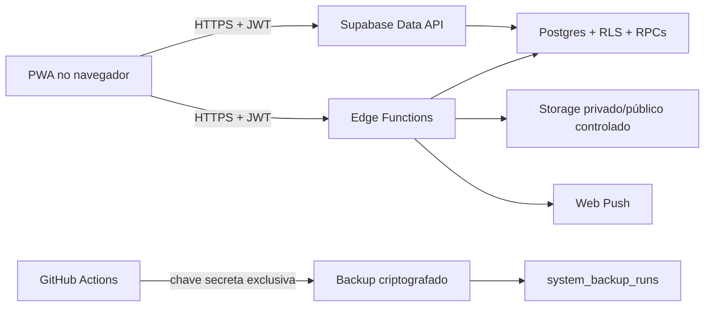
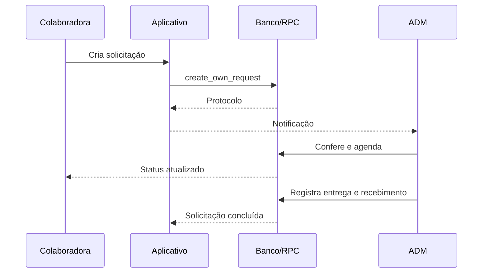
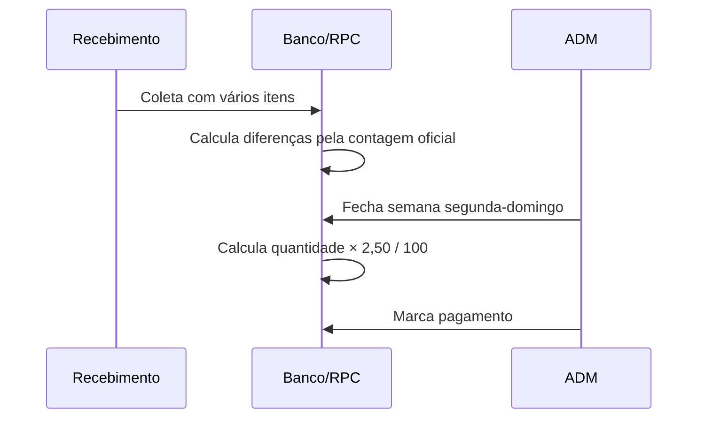
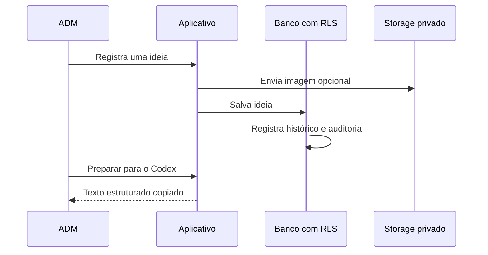
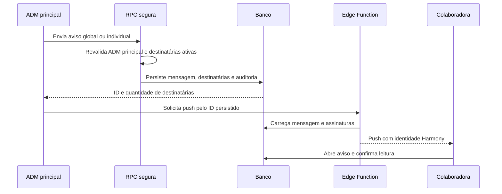
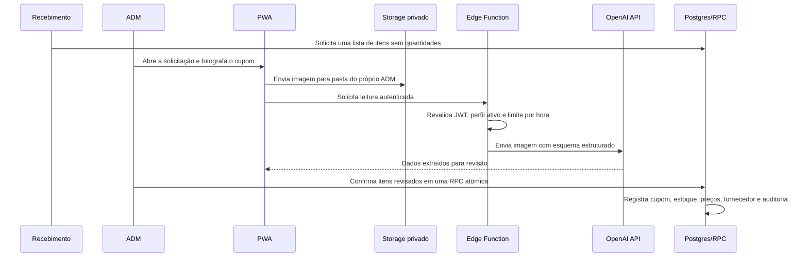

# Arquitetura e operação técnica

## Visão geral

O frontend é uma PWA estática publicada pelo GitHub Pages no domínio oficial. A chave publicável identifica o projeto, mas não concede acesso por si só. Autenticação, RLS, privilégios explícitos e RPCs transacionais formam a autorização efetiva.

## Limites de confiança

- O navegador nunca recebe chave secreta, senha do banco, chave VAPID privada ou segredo HMAC.
- `anon` não possui privilégios de negócio na Data API.
- `authenticated` acessa somente os objetos explicitamente concedidos; RLS limita cada linha.
- `service_role` existe apenas em Edge Functions e automações protegidas.
- Mudanças administrativas importantes são executadas por RPCs `security definer` que revalidam o perfil.
- Logs do cliente aceitam somente código, tela e versão saneados; não armazenam CPF, senha ou conteúdo livre.

## Fluxos principais

As tabelas `improvement_ideas` e `improvement_idea_events` e o bucket privado `idea-attachments` são exclusivos de administradores. O autor original não pode ser substituído, exclusões não são concedidas e cada alteração gera histórico automático. Preparar uma ideia apenas organiza e copia o texto; não autoriza nem executa mudanças no sistema.

`app_notifications` guarda o conteúdo imutável do comunicado e `app_notification_recipients` registra a lista de destinatárias e a leitura individual. O envio é exclusivo de `private.is_primary_admin()`. Colaboradoras não recebem privilégios de escrita direta; a confirmação de leitura passa por RPC que atualiza somente a linha de `auth.uid()`. O push complementa, mas não substitui, a mensagem persistente: falhas de permissão, aparelho offline ou assinatura ausente não apagam o aviso interno.

O campo `products.hidden_from_collaborators` controla apenas a composição de novas solicitações para o perfil `collaborator`. Os perfis `admin` e `receiver` continuam recebendo o catálogo ativo completo. A gravação passa por `admin_save_product_v2`, que reutiliza a operação transacional de produto/fornecedor e registra separadamente qualquer mudança de visibilidade. Itens já vinculados a solicitações não são apagados.

Coletas de produção são corrigidas pela operação transacional `update_finished_production_collection`. Os perfis `admin` e `receiver` podem corrigir qualquer coleta ainda não paga. Se a coleta pertence a um fechamento com status `closed`, a função mantém `worker_id`, `received_on` e `closing_id`, substitui atomicamente os itens, recalcula `total_quantity` e `total_amount` de toda a semana e grava `production.collection_reopened_updated` na auditoria. Fechamentos `paid` são imutáveis para impedir alteração retroativa de pagamentos.

### Suprimentos internos e leitura de cupom

`products.usage_scope='internal'` separa o catálogo interno dos catálogos de produção e e-commerce. `internal_supply_requests` e seus itens não armazenam quantidade solicitada pelo usuário; o valor técnico padrão é 1 e significa apenas “item necessário”. O cupom é a fonte das quantidades e dos valores efetivamente comprados.

Fotos ficam no bucket privado `internal-receipts`. A chave da OpenAI existe apenas como segredo da Edge Function `analyze-internal-receipt`; ela nunca é enviada ao navegador. Somente ADM ativo pode executar a leitura e confirmar compras. O perfil Recebimento acessa solicitações e catálogo, mas RLS bloqueia cupons, itens financeiros, custos de IA e relatórios de valores.

A confirmação usa `confirm_internal_purchase_receipt` para gravar a compra, aumentar o estoque, atualizar custo/fornecedor e concluir parcial ou totalmente a solicitação dentro de uma única transação. Compras diretas usam `request_id=null` e não fabricam solicitações. O histórico de itens do cupom é imutável; cancelamento administrativo preserva o registro, estorna o estoque e grava auditoria.

## Componentes versionados

- `web/`: fonte estática publicada.
- `supabase/migrations/`: esquema, índices, RLS, privilégios e RPCs.
- `supabase/functions/`: usuários, notificações e diagnóstico.
- `tests/`: regressão funcional e segurança.
- `.github/workflows/quality.yml`: build e testes de cada mudança.
- `.github/workflows/backup.yml`: exportação diária, verificação, criptografia e retenção.
- `CHANGELOG.md`: histórico funcional legível também dentro do aplicativo.
- Tags `vN` geram automaticamente uma versão no GitHub com notas calculadas a partir das mudanças publicadas.

## Saúde do Sistema

Somente ADMs veem o painel. A Edge Function valida o JWT e o perfil ativo antes de consultar banco, domínio oficial, Storage, notificações, erros saneados e o último backup. Verde indica operação normal, amarelo exige acompanhamento e vermelho exige ação. O painel nunca expõe mensagens SQL, tokens ou dados pessoais.

## Estratégia de mudanças

1. Criar migration aditiva e rollback quando aplicável.
2. Rodar build e todos os testes.
3. Aplicar banco antes do frontend compatível.
4. Publicar Edge Functions com verificação JWT.
5. Publicar a PWA e validar produção.
6. Registrar versão, evidências e plano de retorno.

Mudanças destrutivas exigem backup válido, janela de manutenção e aprovação específica.
