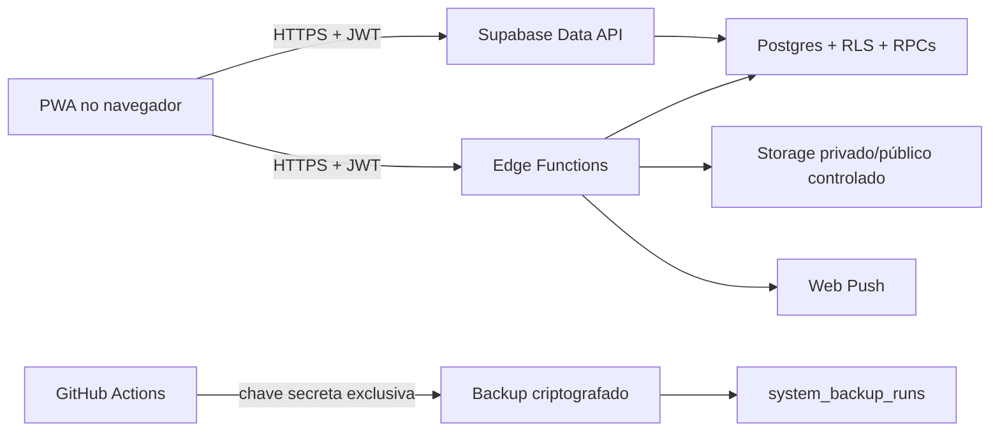
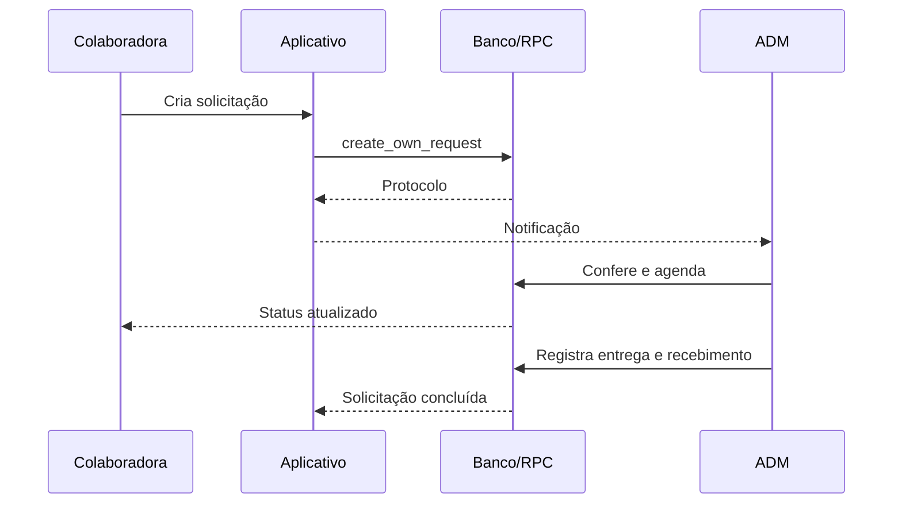
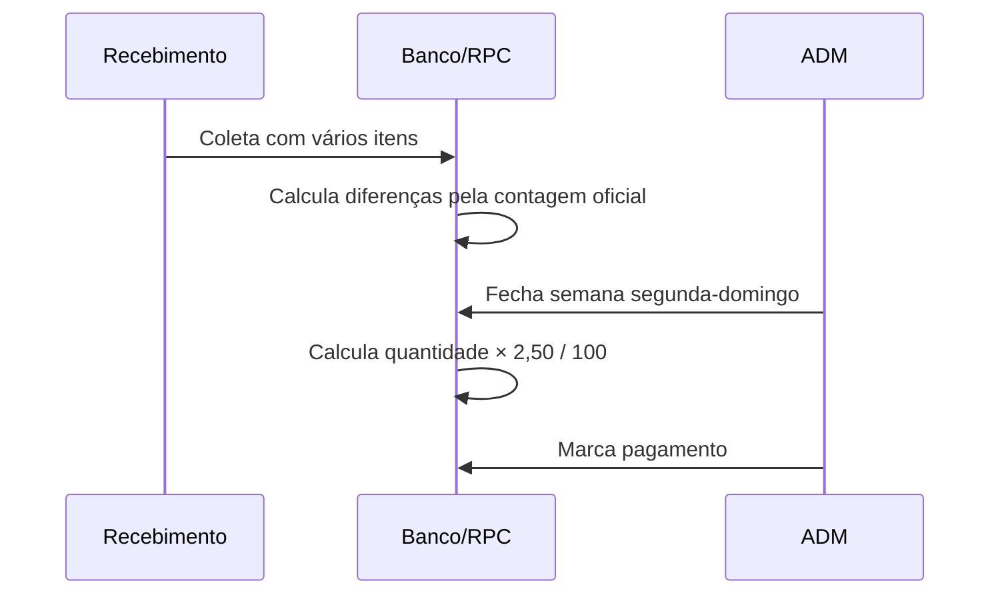

# Arquitetura e operação técnica

## Visão geral

O frontend é uma PWA estática publicada pelo GitHub Pages no domínio oficial. A chave publicável identifica o projeto, mas não concede acesso por si só. Autenticação, RLS, privilégios explícitos e RPCs transacionais formam a autorização efetiva.

## Limites de confiança

- O navegador nunca recebe chave secreta, senha do banco, chave VAPID privada ou segredo HMAC.
- `anon` não possui privilégios de negócio na Data API.
- `authenticated` acessa somente os objetos explicitamente concedidos; RLS limita cada linha.
- `service_role` existe apenas em Edge Functions e automações protegidas.
- Mudanças administrativas importantes são executadas por RPCs `security definer` que revalidam o perfil.
- Logs do cliente aceitam somente código, tela e versão saneados; não armazenam CPF, senha ou conteúdo livre.

## Fluxos principais

## Componentes versionados

- `web/`: fonte estática publicada.
- `supabase/migrations/`: esquema, índices, RLS, privilégios e RPCs.
- `supabase/functions/`: usuários, notificações e diagnóstico.
- `tests/`: regressão funcional e segurança.
- `.github/workflows/quality.yml`: build e testes de cada mudança.
- `.github/workflows/backup.yml`: exportação diária, verificação, criptografia e retenção.
- `CHANGELOG.md`: histórico funcional legível também dentro do aplicativo.
- Tags `vN` geram automaticamente uma versão no GitHub com notas calculadas a partir das mudanças publicadas.

## Saúde do Sistema

Somente ADMs veem o painel. A Edge Function valida o JWT e o perfil ativo antes de consultar banco, domínio oficial, Storage, notificações, erros saneados e o último backup. Verde indica operação normal, amarelo exige acompanhamento e vermelho exige ação. O painel nunca expõe mensagens SQL, tokens ou dados pessoais.

## Estratégia de mudanças

1. Criar migration aditiva e rollback quando aplicável.
2. Rodar build e todos os testes.
3. Aplicar banco antes do frontend compatível.
4. Publicar Edge Functions com verificação JWT.
5. Publicar a PWA e validar produção.
6. Registrar versão, evidências e plano de retorno.

Mudanças destrutivas exigem backup válido, janela de manutenção e aprovação específica.
