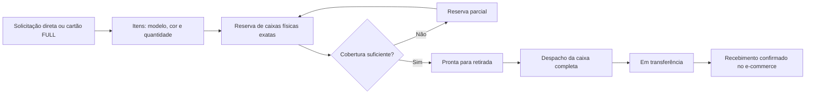

# Central de Transferências — arquitetura v25.92

## Objetivo

Controlar a solicitação e a movimentação de caixas completas do Inventário de Produção para o e-commerce sem manter um saldo fictício do estoque de destino. Solicitações diretas e demandas de cartões FULL compartilham o mesmo motor.

## Modelo de dados

- `shipping_inventory_requests`: cabeçalho, origem, finalidade, prioridade, prazos e ciclo de vida.
- `shipping_inventory_request_items`: fotografia imutável da necessidade por modelo e cor.
- `shipping_inventory_request_boxes`: caixas físicas vinculadas aos itens, com reserva, liberação e transferência.
- `production_inventory_entries`: fonte oficial da caixa e do saldo; nunca é duplicada pela Central.
- `audit_logs`: criação, reserva, cancelamento, despacho e recebimento.

O índice parcial por `inventory_entry_id` impede que uma caixa esteja simultaneamente em duas reservas ativas. Reservas parciais, completas e em trânsito também são removidas das funções antigas de disponibilidade.

## Permissões

- ADM principal, ADM normal e Gerente de e-commerce: criar solicitação direta.
- Gerente de e-commerce e ADM principal: criar demanda vinculada ao Planejamento FULL, reservar caixas e corrigir reservas.
- ADM e Recebimento: consultar, despachar e confirmar recebimento.
- Colaboradora de produção: sem acesso.
- A aplicação usa somente RPCs `security definer` com `search_path=''`; tabelas operacionais permanecem sem escrita direta por `authenticated`.

Desde a v25.97, `private.can_request_transfer_center()` separa a criação direta das permissões de Planejamento. A função `create_transfer_center_request` avalia a origem: solicitações manuais aceitam ADM ativo ou Gerente de e-commerce; solicitações com `plan_item_id` continuam exigindo `private.can_manage_shipping_planning()`. Portanto, o ADM normal não ganha acesso ao Planejamento de Envios nem à seleção de caixas.

## Compatibilidade

Os RPCs anteriores `list_shipping_inventory_options`, `reserve_shipping_inventory_boxes` e `confirm_shipping_inventory_request_transfer` permanecem como adaptadores. Assim, um PWA ainda em cache usa as mesmas restrições e não cria um segundo fluxo paralelo.

## Correções granulares v25.94

- `release_transfer_center_box` libera somente a reserva informada, exige perfil de gestão, motivo e solicitação ainda não despachada.
- `remove_transfer_center_request_item` faz remoção lógica de itens criados em solicitações diretas, preserva o histórico e libera suas caixas.
- Itens do Planejamento FULL não podem ser removidos pela Central, evitando divergência com a origem.
- `private.refresh_transfer_center_request_status` recalcula `requested`, `partially_reserved` ou `reserved` após cada correção.
- A caixa nunca é apagada nem movimentada durante a liberação; somente o vínculo ativo recebe `released_at`, `released_by` e `release_reason`.

## Regras invariantes

1. Uma caixa possui um único código permanente.
2. Reserva não baixa saldo.
3. Despacho baixa sempre a caixa completa.
4. Recebimento encerra o transporte, sem nova baixa.
5. Cancelamento é permitido somente antes do despacho.
6. Toda mudança registra autor e data.

## Recuperação

As três tabelas da Central integram o backup criptografado e o ensaio de restauração. Em rollback de interface, os dados permanecem compatíveis com o módulo FULL anterior por meio dos adaptadores de RPC.
