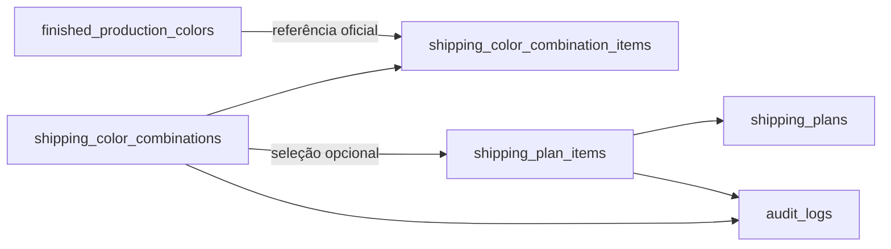

# Combinações de cores — Planejamento de envios v25.82

## Objetivo

Permitir que a Gerente de e-commerce e o ADM principal reutilizem combinações de 2 a 4 cores nos kits do Planejamento de envios sem duplicar ou alterar o catálogo oficial de cores da produção.

## Arquitetura

- `shipping_color_combinations`: cabeçalho, nome automático, assinatura canônica, situação e autores.
- `shipping_color_combination_items`: cores oficiais e posição visual, limitada a 1–4.
- `shipping_plan_items.color_combination_id`: vínculo opcional. A coluna `color_id` é preservada como a primeira cor para manter compatibilidade com a API e os planos antigos.
- `color_signature`: impede cadastros duplicados com as mesmas cores, mesmo quando selecionadas em outra ordem. A ordem escolhida permanece preservada para exibição.

## APIs

- `list_shipping_color_combinations()`: lista somente combinações ativas e válidas.
- `save_shipping_color_combination(uuid, uuid[])`: valida 2–4 cores, bloqueia repetição, monta o nome e registra auditoria.
- `list_shipping_plans_with_colors(text)`: extensão compatível da consulta anterior, incluindo combinação, nome e tonalidades.
- `save_shipping_plan_with_colors(...)`: normaliza o item para a API legada, salva o plano e vincula a combinação na mesma transação.

A API anterior foi preservada para reduzir risco de regressão. O cliente v25.82 usa somente os novos wrappers.

## Segurança e permissões

- RLS habilitada nas duas tabelas novas.
- Autorização centralizada em `private.can_manage_shipping_planning()`.
- Acesso restrito à Gerente de e-commerce e ADM principal.
- Nenhum privilégio direto para `public`, `anon` ou `authenticated`; o acesso ocorre por funções `security definer` com `search_path` vazio.
- Auditoria registra usuário, data, nome e identificadores das cores.
- As cores continuam validadas pelo catálogo oficial e precisam estar ativas na criação.

## Compatibilidade e regras

1. Planos antigos mantêm `color_combination_id = null` e continuam com uma única cor.
2. Combinações não aparecem nos módulos de Produção, Inventário, Solicitações ou Recebimentos.
3. Alterar uma combinação reabre o item concluído para nova conferência.
4. Planos históricos preservam o nome da combinação mesmo que ela seja desativada no futuro.
5. As tabelas foram incluídas no backup criptografado antes dos planos para respeitar as chaves estrangeiras durante a recuperação.

## Testes obrigatórios

- Criar combinações de 2, 3 e 4 cores.
- Recusar 1 cor, 5 cores, cor repetida e cor inativa/inexistente.
- Reutilizar combinação já cadastrada sem duplicar registro.
- Criar e editar plano com cor única e combinação.
- Confirmar que editar combinação reabre um item concluído.
- Exibir tonalidades no formulário, detalhes e PDF.
- Validar computador, tablet e celular sem rolagem horizontal.
- Confirmar RLS, privilégios, auditoria, backup e recuperação.

