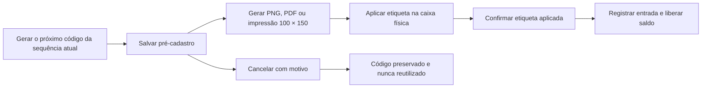

# Etiquetas térmicas do Inventário de Produção — v25.70

## Objetivo

Vincular cada caixa física ao registro digital por uma etiqueta térmica de **100 × 150 mm**, preservando a sequência `CX-NNNNNN`, a rastreabilidade e o saldo real do inventário.

## Fluxo seguro

## Banco e consistência

- `production_inventory_entries.label_status` controla `pending`, `applied` e `cancelled`.
- Entradas `pending` e `cancelled` são obrigatoriamente mantidas com `current_quantity = 0`.
- `label_token` é um UUID único e opaco usado pelo QR Code.
- `production_inventory_label_prints` registra formato, versão do modelo, responsável, horário, reimpressão e motivo.
- Triggers impedem movimentações antes de `label_status = 'applied'`.
- `confirm_production_inventory_label_applied` usa bloqueio de linha e grava o movimento de entrada na mesma transação.
- Cancelar não apaga o registro e não devolve o número à sequência.
- RPCs anteriores continuam compatíveis para aparelhos ainda com cache, usando os padrões de aplicação automática.

## Permissões e privacidade

As tabelas permanecem sem acesso direto para `anon` e `authenticated`. As RPCs usam `security definer`, `search_path = ''` e verificam `private.can_manage_production_inventory()`. Apenas perfis ativos `admin` e `receiver` podem criar, imprimir, confirmar, cancelar ou consultar uma etiqueta.

O QR Code não contém modelo, cor, quantidade, nome da colaboradora ou localização. Ele contém somente uma URL com `label_token`. A consulta exige uma sessão válida e a mesma autorização do módulo.

## Renderização

- PNG: canvas determinístico de **800 × 1200 px**, equivalente a 100 × 150 mm em 203 dpi.
- PDF/impressão: raiz isolada e regra temporária `@page { size: 100mm 150mm; margin: 0 }`.
- Logotipo: arquivo oficial `logo.jpg`, convertido localmente em alto contraste para impressão térmica.
- QR Code: biblioteca MIT `qrcode-generator` v2.0.4, vendorizada e executada localmente, sem API externa.

## Continuidade

O fluxo pendente permite fechar o navegador, trocar de dispositivo ou retomar depois de uma falha de impressão sem criar saldo incorreto. A tabela de auditoria das etiquetas participa do backup criptografado e da restauração isolada.

## Testes obrigatórios

- sequência atual preservada e código cancelado não reutilizado;
- pré-cadastro sem alteração de saldo, contador ou relatórios;
- confirmação idempotente e movimento único;
- bloqueio de transferência e ajuste antes da confirmação;
- RLS, revogações e grants explícitos;
- QR protegido e sem dados pessoais;
- PNG 800 × 1200 e impressão 100 × 150 mm;
- retomada de pendências em computador, celular e tablet;
- espelhamento raiz/web e cache PWA atualizado;
- regressão de pagamentos, solicitações, recebimentos e matérias-primas.
