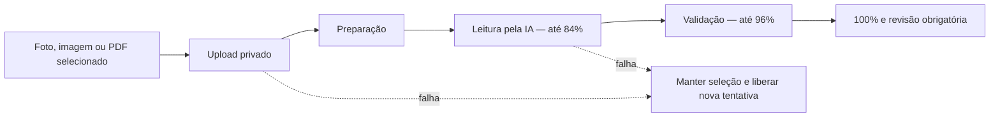

# Experiência de carregamento e leitura por IA — v25.61

## Objetivo

Dar retorno visual imediato sem criar atrasos artificiais, sem alterar as regras dos módulos e sem apresentar um percentual falso como se fosse fornecido pela API.

## Carregamento entre módulos

`harmony-experience.js` envolve a versão final de `renderPage`, depois que todos os módulos registraram seus interceptadores. Cada renderização incrementa um contador de operações ativas e o reduz em `finally`, inclusive quando ocorre erro.

- atraso de 120 ms antes de exibir a camada, para evitar piscadas em renderizações instantâneas;
- permanência visual mínima de 220 ms apenas quando a camada chegou a aparecer;
- `aria-busy` no aplicativo e `role=status` na mensagem;
- contador concorrente para impedir que uma operação encerre o indicador de outra;
- animações desativadas em `prefers-reduced-motion`.

O componente não consulta dados, não troca perfis, não filtra menus e não modifica permissões.

## Leitura inteligente

O controlador `createAIProgress` apresenta quatro fases operacionais:

1. envio protegido do arquivo;
2. preparação do documento;
3. interpretação pela inteligência;
4. validação e preparação da revisão.

O upload e as mudanças de fase são eventos reais. Durante a espera pela inteligência, o percentual é estimado e limitado a 84%. A validação é limitada a 96%. Somente a resposta bem-sucedida permite 100%.

## Segurança e continuidade

- cupons continuam no bucket privado `internal-receipts`;
- boletos continuam no bucket privado `bill-documents`;
- nenhuma informação é salva sem revisão humana;
- uploads criados durante uma tentativa que falha são excluídos;
- o objeto `File` escolhido continua apenas na memória da tela para permitir nova tentativa;
- não houve alteração de banco, RLS, Edge Functions, cálculo, estoque ou pagamento.

## Compatibilidade

O layout usa grade fluida e ajustes abaixo de 640 px. A experiência foi desenhada para computador, tablet, PWA Android e PWA iOS/iPadOS.
