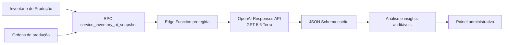

# Inteligência com IA do Inventário — v25.73

## Objetivo

Transformar os dados auditados do Inventário de Produção em prioridades operacionais claras, mantendo cálculos, permissões e decisões críticas fora do modelo de IA.

## Fluxo técnico

## Separação de responsabilidades

- **PostgreSQL/Supabase:** calcula saldos, fluxo, idade, cobertura estimada, qualidade dos dados, ordens e consolidação por modelo, cor e colaboradora.
- **Edge Function:** autentica o ADM, remove nomes antes do envio, controla concorrência, cache, frequência e orçamento, chama a API e valida a resposta.
- **GPT-5.6 Terra:** interpreta somente o JSON consolidado e redige de três a oito insights em português do Brasil.
- **Aplicativo:** exibe indicadores exatos, evidências, histórico e custo. Nenhuma recomendação executa alterações automaticamente.

## Segurança e privacidade

- `OPENAI_API_KEY` permanece exclusivamente nos segredos das Edge Functions.
- A chave de serviço do Supabase não é enviada ao navegador.
- As três tabelas usam RLS e são legíveis somente por administradores ativos.
- As RPCs que montam e finalizam snapshots são executáveis somente por `service_role`.
- Nomes de colaboradoras são substituídos por identificadores genéricos antes da chamada à OpenAI.
- `store: false` desativa o armazenamento da resposta na API.
- Toda saída textual da IA é escapada no cliente, e IDs de ação são validados contra IDs existentes no snapshot.
- O prompt exclui pagamentos e proíbe afirmar que uma ação foi realizada.

## Controle financeiro

- Orçamento inicial: US$ 5/mês.
- Frequência automática preparada no banco: no máximo duas análises por dia; agendamento externo ainda desativado.
- Intervalo manual inicial: 10 minutos.
- Reuso por seis horas quando o fingerprint SHA-256 dos dados não mudou.
- Cada análise registra tokens de entrada/saída e custo estimado.
- Ao alcançar o orçamento, somente novas chamadas de IA são bloqueadas; métricas determinísticas e relatórios continuam disponíveis.

## Banco de dados

- `inventory_ai_settings`: configuração única e limite financeiro.
- `inventory_ai_analyses`: snapshot resumido, modelo, estado, tokens, custo e histórico.
- `inventory_ai_insights`: prioridades, explicações, recomendações, evidências e conferência administrativa.
- `admin_get_inventory_ai_usage()`: uso mensal para o painel.
- `primary_admin_update_inventory_ai_settings(...)`: configuração com auditoria e permissão de ADM principal.
- `admin_mark_inventory_ai_insight(...)`: conferência e ocultação auditadas.
- `service_inventory_ai_snapshot(...)`: consolidação somente para a Edge Function.
- `service_finalize_inventory_ai_analysis(...)`: persistência transacional da resposta validada.

## Continuidade e falhas

- Falha da OpenAI não afeta login, inventário, relatórios ou módulos existentes.
- O novo frontend mostra uma mensagem isolada quando a migração ainda não foi aplicada.
- As tabelas entram no backup criptografado e na restauração isolada.
- Análises em processamento impedem chamadas concorrentes por 15 minutos.
- O painel tradicional de Inteligência foi preservado integralmente como alternativa permanente.

## Implantação

1. Aplicar `20260811230510_inventory_ai_intelligence.sql`.
2. Publicar `analyze-inventory-intelligence` mantendo a verificação JWT do gateway ativa para as análises manuais de ADM.
3. Confirmar `OPENAI_API_KEY` nos segredos do projeto.
4. Publicar a interface v25.73.
5. Executar a validação SQL e os testes de fumaça administrativo, responsivo, custo, histórico e fallback.

O agendamento externo depende de uma autorização de segurança separada, pois a arquitetura preparada exige desativar a verificação JWT do gateway somente nessa função e delegar a autenticação para a validação interna de usuário/segredo. Até essa decisão, nenhum workflow automático é publicado.

## Decisão de produto

Não foi adicionado um campo de perguntas nem perguntas pré-programadas. O painel é proativo: ele identifica prioridades automaticamente para reduzir trabalho manual e manter a experiência simples.
