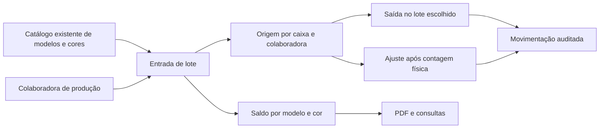

# Inventário de Produção — arquitetura e regras técnicas

## Objetivo

Controlar produtos acabados por modelo e cor com rastreabilidade de origem, mantendo o módulo independente dos recebimentos que calculam pagamentos e do estoque de matérias-primas.

## Fluxo

## Modelo de dados

### `production_inventory_entries`

Representa o lote/caixa e mantém `original_quantity` e `current_quantity`. As chaves `model_id`, `color_id` e `worker_id` apontam para os cadastros oficiais. `source_type` e `source_receipt_id` preparam uma futura integração com recebimentos sem obrigá-la na versão inicial.

### `production_inventory_movements`

Ledger imutável de `entry`, `exit`, `adjustment_in` e `adjustment_out`. Cada linha guarda quantidade, saldo antes, saldo depois, data operacional, motivo, responsável e horário do servidor.

## Permissões

`private.can_manage_production_inventory()` permite somente perfil ativo com papel `admin` ou `receiver`. As tabelas não concedem acesso direto a `authenticated`; leitura e alteração ocorrem exclusivamente pelas RPCs `security definer`, que repetem a autorização no banco.

O perfil `collaborator` não recebe dados mesmo que tente chamar uma RPC manualmente. A lista de produtoras aceita somente perfis ativos com papel `collaborator`, evitando que ADMs ou Recebimento sejam registrados como produtoras.

## Consistência transacional

- Saída e ajuste bloqueiam a linha do lote com `FOR UPDATE`.
- Não é possível retirar mais do que o saldo do lote.
- Quantidades são inteiras e não negativas.
- Datas futuras são recusadas.
- Ajustes iguais ao saldo atual são recusados.
- O saldo da entrada e a movimentação são gravados na mesma transação da RPC.
- Toda mutação cria uma linha em `audit_logs`.

## Limites de integração

O módulo não consulta nem altera `production_weekly_closings`, valores de pagamento, `products`, `stock_movements`, solicitações de materiais ou suprimentos internos. O recebimento oficial continua sendo a única fonte do pagamento.

## Continuidade

As tabelas entram no backup criptografado e na restauração isolada. Como os registros dependem de perfis, modelos, cores e recebimentos opcionais, a ordem de restauração deve manter essas tabelas antes do inventário.

## Impressão

No computador, o relatório abre uma janela isolada contendo apenas o documento. Em celular e tablet, um nó temporário `#productionInventoryPrintRoot` é criado e o modo exclusivo `production-inventory-printing` oculta todo o restante da aplicação. O nó e a classe são removidos após o diálogo de impressão.

## Plano de testes

- autorização positiva para ADM/Recebimento e negativa para Colaboradora;
- entrada válida e rejeições de modelo, cor, produtora, quantidade e data;
- saída total, parcial e bloqueio de saldo insuficiente;
- ajustes positivos e negativos com auditoria;
- ordem alfabética e filtros;
- isolamento do PDF;
- responsividade em 430, 760, 1100 e desktop;
- backup, restauração e espelhamento oficial;
- regressão de pagamentos, recebimentos e matérias-primas.
