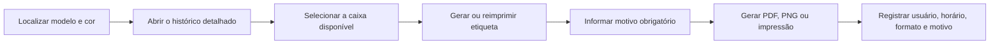

# Reemissão de etiquetas de caixas existentes — v25.72

## Objetivo

Permitir que uma caixa disponível receba uma nova via da sua etiqueta quando a anterior estiver danificada, ilegível, perdida ou quando o registro tiver sido criado antes do fluxo de etiquetas.

## Fluxo

## Invariantes preservadas

- o registro de `production_inventory_entries` não é recriado;
- `box_number`, `label_token` e o QR Code permanecem iguais;
- nenhuma função de entrada, ajuste ou transferência de estoque é chamada;
- a sequência de caixas não é consumida nem reiniciada;
- a quantidade atual e a quantidade original não são alteradas;
- pagamentos, recebimentos de produção e matérias-primas permanecem isolados.

## Compatibilidade com caixas antigas

A migração `20260811133000_production_inventory_thermal_labels.sql` adicionou `label_token uuid not null default gen_random_uuid()` à tabela existente. O PostgreSQL preencheu os registros antigos e o `list_production_inventory_entries_v4` já devolve esse token. Assim, caixas anteriores ao recurso podem usar o mesmo renderizador e não exigem migração adicional.

## Auditoria e segurança

A interface exige uma das justificativas predefinidas ou uma descrição para **Outro motivo**. A saída chama somente `record_production_inventory_label_print`, que:

- verifica `private.can_manage_production_inventory()`;
- rejeita caixas canceladas;
- grava em `production_inventory_label_prints` o formato, motivo, usuário e horário;
- acrescenta um evento em `audit_logs`;
- não expõe acesso direto às tabelas para `anon` ou `authenticated`.

A opção é exibida apenas para uma caixa aplicada, ainda disponível e não transferida. Os perfis continuam limitados a ADM e Recebimento.

## Testes de regressão

- motivo obrigatório e observação obrigatória para **Outro motivo**;
- propagação do motivo para PNG, PDF e impressão;
- preservação do código permanente e do token opaco;
- inexistência de chamada de criação ou movimentação no fluxo;
- funcionamento em computador, celular e tablet;
- espelhamento raiz/web e renovação do cache PWA.
