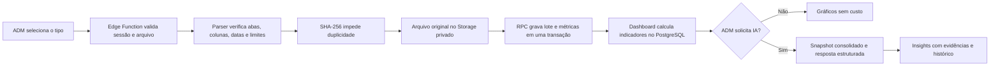

# Shopee Analytics e IA — v25.84

## Objetivo

Consolidar relatórios semanais oficiais da Shopee em métricas auditáveis, gráficos responsivos e insights opcionais por IA, mantendo total isolamento dos módulos operacionais.

## Fluxo

## Separação de responsabilidades

- `process-shopee-report`: autentica, limita, identifica, interpreta e envia um lote transacional.
- `service_commit_shopee_import`: grava somente dados já validados e protege contra concorrência e duplicidade.
- `private.shopee_dashboard_data`: agrega fatos determinísticos; não escreve em nenhuma tabela.
- `analyze-shopee-intelligence`: controla orçamento, intervalo, cache e chamada à OpenAI.
- `service_finalize_shopee_ai_analysis`: salva somente a resposta validada pelo esquema rígido.
- `shopee-intelligence.js`: exibe dados e solicita ações; nunca contém chaves secretas.

## Tipos de relatório

| Tipo | Origem | Dados principais |
|---|---|---|
| `shop_stats` | Shopee Shop Stats | vendas, pedidos, tráfego e produtos |
| `product_funnel` | Product Overview | visita, carrinho, pedido realizado e pago |
| `promotions` | Discount/Marketing | formatos, tendências e campanhas |

## Consistência

- Hash SHA-256 por conteúdo.
- Índice único por tipo, período e hash.
- Um único lote atual por tipo e período.
- Versões substituídas permanecem no histórico.
- Bloqueio transacional por tipo e período evita duas importações simultâneas.
- O dashboard consulta apenas lotes `validated` e `is_latest`.

## Evolução executiva v25.85

- A interface continua consumindo exclusivamente `admin_get_shopee_dashboard`; nenhum cálculo financeiro foi transferido para o navegador.
- A série diária utiliza `placed_sales` e `paid_sales` no modo faturamento e `placed_orders` e `paid_orders` no modo pedidos.
- Pontos, escala, cartões diários e seleção por toque compartilham o mesmo conjunto de dados retornado pelo Supabase.
- A tela principal apenas reorganiza funil, tráfego, produtos, qualidade e IA; não cria uma segunda fonte de verdade.
- O logotipo é carregado do ativo local `assets/platform-shopee.svg`, sem dependência de rede externa.

## Segurança e privacidade

- Apenas perfis `admin` ativos podem importar, consultar e gerar análise.
- Origem CORS restrita aos endereços oficiais e ambientes locais de teste.
- Arquivos `.xlsx`, assinatura ZIP, limite de 12 MB, no máximo 30 abas e 100 mil linhas processadas.
- Storage privado, RLS, privilégios mínimos e funções internas concedidas somente a `service_role`.
- `OPENAI_API_KEY` e `SUPABASE_SERVICE_ROLE_KEY` permanecem exclusivamente nas Edge Functions.
- A chamada à OpenAI usa `store:false`, JSON Schema estrito, cache e orçamento mensal.
- Nenhuma informação de cliente é necessária nos relatórios analisados.

## Falha segura

Falhas de importação não criam lote parcial. Falhas da IA não afetam as métricas. O módulo não executa mutações em estoque, produção, solicitações, pagamentos ou serviços externos da Shopee.

## Importação incremental por dia — v25.86

- `shopee_import_batches` continua sendo o documento auditável de cada arquivo recebido.
- `shopee_import_days` define qual lote é a fonte canônica de cada combinação `tipo de relatório + dia`.
- O modo `append` aceita somente dias ainda ausentes. Uma planilha semanal pode complementar arquivos diários anteriores sem duplicar métricas.
- O modo `replace` é separado, exige confirmação na interface e reatribui somente os dias presentes no arquivo corrigido.
- A RPC retorna datas aceitas e ignoradas. O cliente muda o filtro para o período detectado imediatamente após a gravação.
- Métricas diárias do dashboard fazem `join` com o livro de dias. Retratos agregados de produtos, tráfego e campanhas preservam o arquivo de maior cobertura para evitar soma dupla.
- A tabela nova possui RLS, leitura administrativa, privilégio integral apenas para `service_role`, índice por lote e cobertura nos fluxos de backup e recuperação.

O salvamento de kits compostos também foi corrigido na mesma versão: o item intermediário nasce como um exclusivo válido e recebe `item_kind='kit'` e `kit_template_id` atomicamente na mesma transação. A restrição de integridade não foi enfraquecida.

## Consolidação diária e calendário de cobertura — v25.91

- O parser `1.3.0` detecta relatórios de um único dia com linhas horárias em `Pedido Feito` e `Produto Pago`.
- Para esse formato, `rows[1]` é a linha consolidada oficial e gera exatamente um fato `placed` e um fato `paid` para a data. Métricas não aditivas, como visitantes e compradores, nunca são somadas por hora.
- Relatórios semanais continuam usando suas linhas diárias; o ramo horário só é executado quando `period_start = period_end` e há horário no campo de data.
- Se a RPC transacional falhar, o objeto recém-enviado ao Storage é removido. Objetos já existentes não são apagados.
- O calendário consulta `shopee_import_days` sob a RLS administrativa já existente e transforma a contagem de tipos por dia em quatro estados visuais.
- Vermelho e amarelo são atalhos de diagnóstico e importação, não operações de banco. O registro canônico continua pertencendo exclusivamente à RPC de importação.
