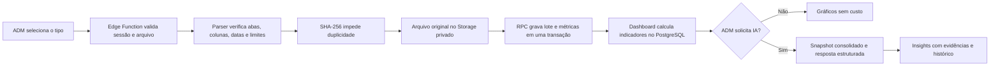

# Shopee Analytics e IA — v25.84

## Objetivo

Consolidar relatórios semanais oficiais da Shopee em métricas auditáveis, gráficos responsivos e insights opcionais por IA, mantendo total isolamento dos módulos operacionais.

## Fluxo

## Separação de responsabilidades

- `process-shopee-report`: autentica, limita, identifica, interpreta e envia um lote transacional.
- `service_commit_shopee_import`: grava somente dados já validados e protege contra concorrência e duplicidade.
- `private.shopee_dashboard_data`: agrega fatos determinísticos; não escreve em nenhuma tabela.
- `analyze-shopee-intelligence`: controla orçamento, intervalo, cache e chamada à OpenAI.
- `service_finalize_shopee_ai_analysis`: salva somente a resposta validada pelo esquema rígido.
- `shopee-intelligence.js`: exibe dados e solicita ações; nunca contém chaves secretas.

## Tipos de relatório

| Tipo | Origem | Dados principais |
|---|---|---|
| `shop_stats` | Shopee Shop Stats | vendas, pedidos, tráfego e produtos |
| `product_funnel` | Product Overview | visita, carrinho, pedido realizado e pago |
| `promotions` | Discount/Marketing | formatos, tendências e campanhas |

## Consistência

- Hash SHA-256 por conteúdo.
- Índice único por tipo, período e hash.
- Um único lote atual por tipo e período.
- Versões substituídas permanecem no histórico.
- Bloqueio transacional por tipo e período evita duas importações simultâneas.
- O dashboard consulta apenas lotes `validated` e `is_latest`.

## Segurança e privacidade

- Apenas perfis `admin` ativos podem importar, consultar e gerar análise.
- Origem CORS restrita aos endereços oficiais e ambientes locais de teste.
- Arquivos `.xlsx`, assinatura ZIP, limite de 12 MB, no máximo 30 abas e 100 mil linhas processadas.
- Storage privado, RLS, privilégios mínimos e funções internas concedidas somente a `service_role`.
- `OPENAI_API_KEY` e `SUPABASE_SERVICE_ROLE_KEY` permanecem exclusivamente nas Edge Functions.
- A chamada à OpenAI usa `store:false`, JSON Schema estrito, cache e orçamento mensal.
- Nenhuma informação de cliente é necessária nos relatórios analisados.

## Falha segura

Falhas de importação não criam lote parcial. Falhas da IA não afetam as métricas. O módulo não executa mutações em estoque, produção, solicitações, pagamentos ou serviços externos da Shopee.
