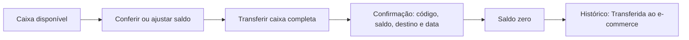

# Transferência integral de caixas — v25.59

## Regra

Uma caixa física deixa o Inventário de Produção somente por inteiro. O saldo atual conferido é a quantidade transferida para o estoque físico do e-commerce. O aplicativo não aceita quantidade manual nesse fluxo.

## Persistência

Foram adicionados a `production_inventory_entries`:

- `transfer_destination`, limitado a `ecommerce`;
- `transferred_on`, data operacional;
- `transferred_at`, instante auditável;
- `transferred_by`, responsável vinculado a `profiles`.

A restrição `production_inventory_transfer_state_check` exige que os quatro campos estejam juntos e que o saldo seja zero quando a caixa estiver transferida.

## APIs

- `transfer_production_inventory_box_to_ecommerce(uuid,date,text)` obtém o saldo sob bloqueio e transfere a caixa integralmente.
- `withdraw_production_inventory_entry(...)` permanece disponível para clientes em cache, mas agora rejeita quantidade diferente do saldo da caixa.
- `adjust_production_inventory_entry(...)` bloqueia alterações após a transferência.
- `list_production_inventory_entries_v3(...)` inclui situação, destino, data e responsável pela transferência.

## Segurança e concorrência

As alterações são executadas em uma única transação e usam `for update`. Somente ADM e Recebimento ativos passam por `private.can_manage_production_inventory()`. A operação registra uma movimentação `exit` integral e o evento `production_inventory.box_transferred_to_ecommerce` em `audit_logs`.

## Limites do módulo

O destino representa a movimentação física da caixa. Esta versão não cria um segundo saldo de produtos acabados no e-commerce. Também não altera produtos, matérias-primas, recebimentos oficiais, ordens de produção ou pagamentos.
